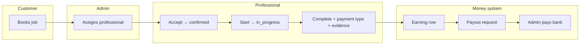
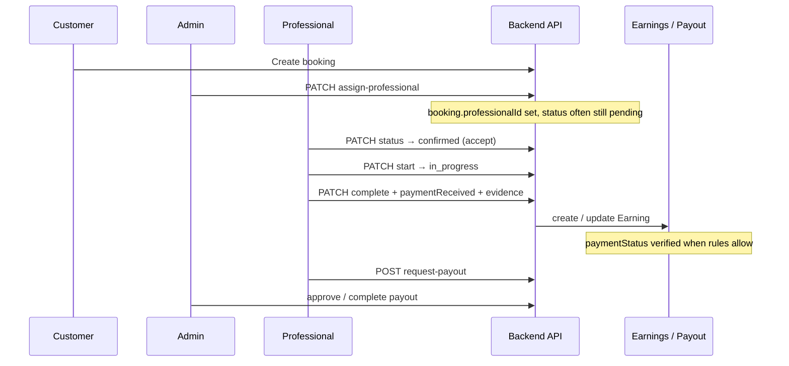

# Booking, roles & money flow — “explain like I’m five” + flags

This document describes **who does what**, which **status flags** move, and how **money** eventually reaches the professional’s bank. It matches the **Fixer admin app**, **Fixer provider (professional) app**, and **fixer-backend** (`/api/bookings`, `/api/earnings`) as implemented today.

---

## 1. The three “teams” in one story

Imagine a **pizza order**, but for home service:

| Who | Simple job |
|-----|----------------|
| **Customer** | Orders the service, pays (now or later), gets the work done. |
| **Professional** | The person who actually shows up, does the job, says “I got paid” (for cash), finishes the job. |
| **Admin** | The “control room”: assigns a professional, can see everything, can verify money for payouts, approves bank payouts. |

There is also a **company “provider”** account in some setups; this doc focuses on **admin + professional + customer**.

---

## 2. Booking lifecycle (happy path) — one diagram

Think of a booking as a **card on a wall** that moves columns.



**In plain words**

1. Customer creates a booking → usually **`pending`** (nobody locked in yet, or waiting for pro).
2. **Admin** picks a professional → booking still often **`pending`**, but now has **`professionalId`** + **`assignedAt`** (the “this pro is invited” sticker).
3. **Professional** taps **Accept** → booking becomes **`confirmed`** (yes, I’ll do it).
4. **Professional** taps **Start** → **`in_progress`** (I’m on the job).
5. **Professional** taps **Complete** → **`completed`**, and tells the app **cash vs online**, plus **notes and/or photos** (evidence).
6. Backend creates an **Earning** row (one per booking) — that’s “the platform owes the pro X rupees for this job.”
7. When rules say the money is **trusted**, the earning becomes **verified** and can go into a **payout request**.
8. **Admin** (or finance) **approves / completes** the payout → money sent to pro’s bank.

---

## 3. Bigger picture — swimlane (who touches what)



---

## 4. Flags you actually care about (the “sticky notes” on data)

### 4.1 Booking (`Booking` in Mongo — what the job is)

| Field / idea | Values (main ones) | Kid explanation |
|--------------|--------------------|------------------|
| **`status`** | `pending`, `confirmed`, `in_progress`, `completed`, `cancelled` | Which **step** the job is on. |
| **`professionalId`** | ObjectId or empty | **Which pro** is responsible (after admin assigns). |
| **`assignedAt`** | date or empty | When admin **stuck the pro’s name** on the card. |
| **`paymentStatus`** (booking) | `pending`, `paid`, `refunded` | Did the **customer’s money** reach the platform / marked done for this booking? |
| **`paymentMethod`** | e.g. `pay_now`, `cash`, `online`, … | **How** the customer was supposed to pay. |
| **`notes`** | text | Messages / completion text; may include photo URLs in a block. |
| **`completionPhotoUrls`** | list of URLs | After-job **photos** (optional list on booking). |
| **`completionEvidenceOk`** | `true` / `false` | “Pro left **either** real notes **or** photos for this completion” — used with payouts / trust. |
| **`acceptDeadlineAt`** | ISO date or empty | After **admin assign**, the pro should **accept** before this time when `BOOKING_SLA_ENFORCE` is not `false`. |
| **`preJobDamagePhotoUrls`** | list of URLs | **Pre-job** condition / damage photos (insurance trail), separate from completion evidence. |
| **`partialRefundRecords`** | array of `{ amount, reason, recordedAt, … }` | **Admin ledger** partial refunds (no gateway); for support and accounting notes. |

**Important:** When admin **assigns** a professional, the code **does not** auto-flip `status` to “confirmed” — the pro still has to **accept** (so nobody is forced into a job silently).

---

### 4.2 Professional accept vs reject

| Action | What happens (typical API) | Booking flag |
|--------|----------------------------|----------------|
| **Accept** | `PATCH /bookings/:id/status` with `status: "confirmed"` (app may send `"scheduled"`; server maps to **`confirmed`**) | `status = confirmed` |
| **Reject** | Usually **cancel** the booking: `PATCH /bookings/:id/cancel` with a **reason** | `status = cancelled` + reason |

So “reject” is not a separate rainbow flag — it’s **cancel** from the pro’s side (same as “I can’t do this job”).

---

### 4.3 Start service

| API (professional) | Effect |
|--------------------|--------|
| `PATCH /api/bookings/:id/start` | Sets **`status = in_progress`**, can attach **start notes**; customer + admins can get notifications. |

**Rule of thumb:** only from **`pending`** or **`confirmed`** → **`in_progress`**.

---

### 4.4 Complete service + payment + evidence

| API | Body highlights |
|-----|-----------------|
| `PATCH /api/bookings/:id/complete` (also `PUT` variants) | `paymentReceived`: **`cash`** or **`online`**, `notes`, optional `completionPhotoUrls`, `notifyAdmin`, `notifyCustomer` |

**Server rule (industry style):** you need **either** non-empty completion **notes** **or** at least one **completion photo URL** — so there is always a paper trail.

After success:

- Booking → **`completed`**, **`completedDate`**, often **`paymentStatus = paid`** on the booking for this flow.
- **`completionEvidenceOk`** stored on booking when completion is valid.
- **Earning** row created/updated (see below).

---

### 4.5 Earning row (`Earning` — “this job owes the pro money”)

One booking → **one earning** (unique on `bookingId`).

| Field | Values | Kid explanation |
|-------|--------|------------------|
| **`professionalEarnings`** | number | **How many rupees** the pro gets after commission. |
| **`paymentStatus`** | `pending`, `customer_paid`, `verified`, `settled_to_professional` | Is the **customer payment story** trusted enough to pay the pro? |
| **`payoutStatus`** | `pending`, `requested`, `processing`, `paid`, `on_hold` | Has this chunk of money **left the platform wallet** toward the pro? |
| **`completionEvidenceOk`** | `true` / missing / `false` | Missing = **old data** (grandfathered). `false` = **blocked** from payout batches that require evidence. |

**Typical ladder**

1. **`pending`** — job done but money not fully trusted yet (common for pay-after / cash paths).
2. **`customer_paid`** — “customer paid” was recorded (cash on site, or mark-received flow).
3. **`verified`** — platform trusts it (**prepaid online** often jumps here; cash may need **admin verify**).
4. **`settled_to_professional`** — optional later stage when fully closed in some setups.

---

### 4.6 Payout (`Payout` — “send these earnings to the bank”)

| Step | Who | API |
|------|-----|-----|
| Pro asks for withdrawal | Professional | `POST /api/earnings/professional/request-payout` |
| Admin sees queue | Admin | `GET /api/earnings/admin/payouts?status=...` |
| Admin moves money | Admin | `approve` / `complete` payout endpoints |

**Payout batch only includes earnings that are:**

- `paymentStatus === "verified"`
- `payoutStatus === "pending"` (not already in another batch)
- `completionEvidenceOk !== false` (so explicit `false` never enters the batch; missing field = legacy OK)

---

## 5. Role cheat sheet (“who is allowed to press this button?”)

| Action | Customer | Professional | Admin |
|--------|----------|--------------|-------|
| Create booking | Yes | — | — |
| List all bookings | — | — | Yes |
| **Assign professional** | — | — | `PATCH /bookings/:id/assign-professional` |
| **Unassign professional** | — | — | `PATCH /bookings/:id/unassign-professional` |
| See booking by id | If involved | If assigned / theirs | Yes |
| **Accept** (status → confirmed) | — | Yes (assigned) | Often yes (support) |
| **Reject** (cancel + reason) | Own booking | If allowed by rules | Yes |
| **Start** job | — | Yes | Often yes |
| **Complete** job | — | Yes | Often yes |
| Mark payment received (cash flows) | — | Yes | Depends on implementation |
| **Verify payment** on earning | — | — | `POST /api/earnings/admin/:earningId/verify-payment` |
| **Request payout** | — | Yes | — |
| **Approve / pay out** | — | — | Yes |

*(Exact “professional vs admin” for complete/start may follow the same `requireProviderOrProfessional` middleware on the API — treat admin as “super user” who can help in support cases.)*

---

## 6. ASCII flow — one page cheat

```
CUSTOMER BOOKS
      |
      v
[ pending ]  <---------------------- admin assigns professionalId
      |
      +---- professional ACCEPTS --> [ confirmed ]
      |
      +---- professional REJECTS --> [ cancelled ]
      
[ confirmed ] --start--> [ in_progress ]

[ in_progress ] --complete + evidence + payment type --> [ completed ]
                                                      |
                                                      v
                                               EARNING created/updated
                                                      |
                                                      v
                               paymentStatus: pending / customer_paid / verified
                                                      |
                                                      v (when verified + rules OK)
                               PRO: POST request-payout  --->  PAYOUT requested
                                                      |
                                                      v
                               ADMIN: approve/complete ---> money to bank
```

---

## 7. API index (copy-paste friendly)

Base: `/api` (your server may prefix routes; bookings often mounted as `/api/bookings`, earnings as `/api/earnings`).

### Bookings

| Method | Path | Role | What it does |
|--------|------|------|----------------|
| `PATCH` | `/bookings/:id/assign-professional` | Admin | Stick a **professional** on the booking |
| `PATCH` | `/bookings/:id/unassign-professional` | Admin | Remove assignment |
| `PATCH` | `/bookings/:id/status` | Pro / provider | **Accept** (`confirmed`), or other allowed status |
| `PATCH` | `/bookings/:id/start` | Pro / provider | **Start** → `in_progress` |
| `PATCH` / `PUT` | `/bookings/:id/complete` | Pro / provider | **Finish** job + payment + evidence |
| `POST` | `/bookings/:id/payment/mark-received` | Pro / provider | Mark cash / received flows where used |
| `PATCH` | `/bookings/:id/cancel` | Customer / admin | **Cancel** (reject path for pro) |
| `PATCH` | `/bookings/:id/pre-job-damage-photos` | Pro / provider | Append **pre-job** condition photo URLs (`{ photoUrls: string[] }`) |
| `POST` | `/bookings/:id/admin-partial-refund` | Admin | Record **partial refund** on booking (ledger only; `{ amount, reason }`) |

### Earnings & payouts

| Method | Path | Role | What it does |
|--------|------|------|----------------|
| `GET` | `/earnings/professional/summary` | Pro | Wallet-style **summary** (`verifiedBalance`, etc.) |
| `GET` | `/earnings/professional/earnings` | Pro | **Rows** of earnings |
| `POST` | `/earnings/professional/request-payout` | Pro | Ask for **bank payout** |
| `GET` | `/earnings/professional/payouts` | Pro | **History** of payout requests |
| `POST` | `/earnings/:earningId/mark-paid` | Pro | Mark customer paid (path used by app in some flows) |
| `POST` | `/earnings/admin/:earningId/verify-payment` | Admin | **Trust** cash / manual payment → moves earning toward **verified** |
| `POST` | `/earnings/admin/:earningId/dispute` | Admin | `{ open: boolean, reason?: string }` — **dispute** on earning; payout pool excludes while open |
| `GET` | `/earnings/admin/payouts` | Admin | List payout requests |
| `POST` | `/earnings/admin/payouts/:payoutId/approve` | Admin | Approve batch |
| `POST` | `/earnings/admin/payouts/:payoutId/complete` | Admin | Mark paid out with reference |

---

## 7b. Environment knobs (backend)

| Variable | Role |
|----------|------|
| `BOOKING_ACCEPT_SLA_HOURS` | Hours until **`acceptDeadlineAt`** after admin assign (default **24**, clamped 1–168). |
| `BOOKING_SLA_ENFORCE` | If not `false`, accepting after **`acceptDeadlineAt`** is rejected. |
| `PAYOUT_MINIMUM_RUPEES` | Minimum verified balance for **request-payout**; echoed on professional summary as **`minimumPayoutRupees`**. |
| `PAYOUT_SECOND_APPROVAL_AMOUNT_RUPEES` | Gross payout batch amount requiring **two** admin approvers (default **50000**). |
| `ACCOUNTING_WEBHOOK_URL` | Optional HTTPS URL; **POST** JSON when a payout batch is **completed** (paid). |
| `ACCOUNTING_WEBHOOK_SECRET` | Optional shared secret for the accounting webhook. |

---

## 8. “If I’m debugging, what do I check first?”

1. **Booking** `status` — is it stuck before `confirmed`?
2. **Booking** `professionalId` — did admin assign?
3. **Booking** `paymentStatus` + `paymentMethod` — prepaid vs cash vs pay later?
4. **Earning** exists? (`bookingId` unique)
5. **Earning** `paymentStatus` — must reach **`verified`** for auto-included payout pool.
6. **Earning** `completionEvidenceOk` — not `false`.
7. **Professional** bank profile complete (holder name, account, IFSC, bank name) before `request-payout`.

---

## 9. Suggestions — implemented vs optional

Most of the earlier “wish list” is now wired in **fixer-backend** plus UI in **fixer-admin** / **fixerprovider**:

| Idea | Status |
|------|--------|
| **Decline** UX (label + copy; still **cancel** API) | Provider: **Decline** on booking detail. |
| **SLA** (accept within X hours) | Backend: **`acceptDeadlineAt`** + enforce flag; provider: banner + accept modal. |
| **Customer notification** on accept | Backend on transition to **confirmed** (assign/start may already exist elsewhere). |
| **Partial refunds** | Backend **ledger** + admin **Support and ledger** card. |
| **Insurance / damage photos** | Backend **`preJobDamagePhotoUrls`** + provider upload; admin thumbnails. |
| **Two-person approval** for large payouts | Backend **`PAYOUT_SECOND_APPROVAL_AMOUNT_RUPEES`**. |
| **Minimum payout hint** | Backend **`PAYOUT_MINIMUM_RUPEES`** on professional summary; provider withdrawal screen. |
| **Dispute** state | Backend **`disputeOpen`** + **`POST .../dispute`**; admin booking detail controls. |
| **Accounting webhook** | Backend on payout **complete** (`ACCOUNTING_WEBHOOK_URL`). |
| **Audit log** on assign + verify payment | Backend **AuditLog** entries. |

**Per-city minimum payout** is still a future product rule (would need city on summary or config service); today the minimum is one global env value.

---

## 10. Where this is implemented (for devs)

| Area | Repo / path |
|------|-------------|
| Booking routes | `fixer-backend/src/modules/bookings/routes/bookings.ts` |
| Assign / status / start / complete | `fixer-backend/src/modules/bookings/services/BookingServiceMongo.ts` |
| Earnings create / payout rules | `fixer-backend/src/modules/earnings/services/EarningsService.ts` |
| Completion evidence helper | `fixer-backend/src/modules/bookings/utils/completionEvidence.ts` |
| Admin UI booking detail | `fixer-admin/src/pages/bookings/booking-details.tsx` |
| Provider completion + photos + SLA + pre-job damage | `fixerprovider/src/screens/main/BookingDetailScreen.tsx`, `bookingService.ts`, `bookingMapper.ts` |
| Admin partial refund + earning dispute | `fixer-admin/src/pages/bookings/booking-details.tsx`, `bookings.service.ts` |

---

### TL;DR for your “flags” question

- **Booking `status`** = where the **job** is in the story.  
- **Booking `paymentStatus`** = whether the **customer money** side is settled on that booking.  
- **Earning `paymentStatus`** = whether the platform **trusts** paying the pro for that job.  
- **Earning `payoutStatus`** = whether that money **already left** in a payout batch.  
- **`completionEvidenceOk`** = “we have **proof** the job was closed properly” — tied to **trust** and **payout**.

If you want this doc inside **fixer-backend** or **fixerprovider** too, copy the file or symlink it in their `docs/` folders so all teams read the same story.
