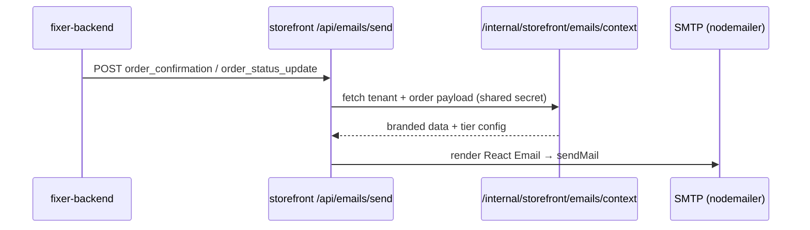

# Storefront transactional email system

> **Status:** Implemented  
> **Stack:** SMTP (nodemailer) + React Email (Next.js storefront) + fixer-backend triggers  
> **Transport:** No Resend required — uses the same SMTP credentials as `fixer-backend`  
> **Scope:** Storefront orders only — generic SMTP order emails in `EmailService` are unchanged for non-storefront flows.

---

## Goal

Send two email types for storefront customers:

1. **Order Confirmation** — sent immediately when an order is placed
2. **Order Status Update** — sent when status changes (`Confirmed` → `Preparing` → `Out for Delivery` → `Delivered`)

---

## File structure

```
profixer-admin-frontend/storefront/
├── emails/
│   ├── components/
│   │   └── EmailLayout.tsx       # Shared wrapper (brand, logo, Menufast footer)
│   ├── OrderConfirmation.tsx
│   ├── OrderStatusUpdate.tsx
│   └── types.ts
├── lib/storefront-email/
│   ├── send.ts                   # Render React Email + dispatch
│   ├── smtp.ts                   # nodemailer transporter (same env as backend)
│   └── status-labels.ts
└── app/api/emails/
    ├── send/route.ts             # POST { type, tenant_id, order_id }
    └── verify-domain/route.ts    # Premium: format check + manual confirm

homeservice_monolotic/fixer-backend/src/
├── models/Tenant.ts              # + emailConfig subdocument
├── modules/storefront-studio/
│   ├── services/
│   │   ├── StorefrontTransactionalEmailService.ts  # HTTP trigger → storefront
│   │   └── storefrontEmailHelpers.ts
│   ├── controllers/StorefrontEmailController.ts
│   └── routes/
│       ├── storefrontEmailInternal.ts              # GET /internal/storefront/emails/context
│       └── storefrontStudio.ts                     # + /email-config routes

profixer-admin-frontend/src/
├── components/storefront/StorefrontEmailSettings.tsx
└── services/api/storefrontStudio.service.ts
```

---

## Architecture



### Flow

1. **Order placed** (`StorefrontCheckoutService.verifyAndCreateOrder`) or **status updated** (`OrderServiceMongo.updateOrderStatus`) calls `triggerStorefrontEmail()` on the backend.
2. Backend POSTs to `{STOREFRONT_BASE_URL}/api/emails/send` with `{ type, tenant_id, order_id, new_status? }`.
3. Storefront API fetches render context from `GET /api/internal/storefront/emails/context`.
4. Storefront renders the React Email template and sends via **nodemailer** using `SMTP_*` env vars.

Storefront orders are detected by `notes` containing `"storefront"` (e.g. `"Storefront online order"`).

---

## Email templates

### EmailLayout (shared wrapper)

- Tenant `brand_name` prominently at top (from storefront config / tenant name)
- Tenant `brand_color` for accents (fallback: `#FF5C00`)
- Tenant `logo_url` if available; otherwise text brand name
- Footer **"Powered by Menufast"** — only for Tier 1 (free/local) tenants
- Minimal, mobile-friendly inline styles (Gmail / Apple Mail safe)

### OrderConfirmation data shape

```typescript
{
  tenant: { brand_name, brand_color, logo_url, from_email, is_premium? },
  customer: { name, phone? },
  order: {
    id,                        // order number
    items: [{ name, qty, price }],
    total,
    estimated_time?
  },
  payment_method: "COD" | "Online"
}
```

### OrderStatusUpdate data shape

```typescript
{
  tenant: { brand_name, brand_color, is_premium? },
  customer: { name },
  order: {
    id,                        // order number
    new_status,                // customer-facing label
    estimated_time?
  }
}
```

### Internal status → customer label

| Backend status | Email label        |
| -------------- | -------------------- |
| `confirmed`    | Confirmed            |
| `processing`   | Preparing            |
| `shipped`      | Out for Delivery     |
| `delivered`    | Delivered            |

Status-update emails fire only for `processing`, `shipped`, and `delivered` — not on initial placement (confirmation handles that).

---

## Two-tier sending (both via platform SMTP)

All sends go through the **same SMTP account** configured on the storefront. Tier differences are only in the **From header** and **footer**.

### Tier 1: Local / free tenants

| Field        | Value                                              |
| ------------ | -------------------------------------------------- |
| **From**     | `STOREFRONT_SMTP_FROM` or `SMTP_USER`              |
| **Display**  | `{Tenant Brand Name} via Menufast`                 |
| **Example**  | `The Brown Butter via Menufast <orders@menufast.in>` |
| **Reply-To** | Tenant contact email from storefront branding      |
| **Footer**   | "Powered by Menufast"                              |

### Tier 2: Premium tenants (custom From address)

Requires **Growth+ plan** and **confirmed** From address in admin.

| Field        | Value                                      |
| ------------ | ------------------------------------------ |
| **From**     | Tenant's saved `from_email`                |
| **Display**  | `{emailDisplayName}`                       |
| **Example**  | `The Brown Butter <orders@thebrownbutter.com>` |
| **Transport**| Same platform SMTP (no per-tenant API key) |
| **Footer**   | Brand name only — no Menufast footer       |

Premium is **active** when:

- `emailConfig.fromEmail` is set
- `emailConfig.isEmailVerified === true` (manual confirm in admin after DNS/SPF setup)

Growth+ **eligibility** (can configure in admin) is based on `planKey` containing `growth`, `pro`, `scale`, or `enterprise` — not `starter`.

> **Note:** Many SMTP providers (e.g. Gmail) only allow sending as the authenticated mailbox. Custom From addresses may require SPF/DKIM on your domain or a provider that supports sender aliases. Resend can be added later as an optional upgrade path without changing the templates.

---

## Tenant model (`emailConfig`)

Added to `fixer-backend/src/models/Tenant.ts`:

```typescript
emailConfig?: {
  emailProvider?: 'none' | 'resend' | 'smtp';  // currently always 'smtp'
  fromEmail?: string;
  resendApiKeyEnc?: string;      // reserved for future Resend support
  emailDisplayName?: string;
  isEmailVerified?: boolean;     // manual confirm in SMTP mode
}
```

Branding (name, color, logo, contact email) comes from `TenantStorefrontConfig.branding`.

---

## API routes

### Storefront (Next.js)

| Method | Path                         | Auth                              | Purpose                          |
| ------ | ---------------------------- | --------------------------------- | -------------------------------- |
| POST   | `/api/emails/send`           | `x-storefront-email-secret`       | Render + send email via SMTP     |
| POST   | `/api/emails/verify-domain`  | None                              | Validate From email format (SMTP mode) |

**Send body:**

```json
{
  "type": "order_confirmation" | "order_status_update",
  "tenant_id": "<mongo ObjectId>",
  "order_id": "<mongo ObjectId>",
  "new_status": "processing"
}
```

### Backend (fixer-backend)

| Method | Path                                          | Auth                        | Purpose                    |
| ------ | --------------------------------------------- | --------------------------- | -------------------------- |
| GET    | `/api/internal/storefront/emails/context`     | `x-storefront-email-secret` | Build render payload       |
| GET    | `/api/storefront-studio/email-config`         | JWT + tenant admin          | Read premium email config  |
| PATCH  | `/api/storefront-studio/email-config`         | JWT + Growth+               | Save from email + display name |
| POST   | `/api/storefront-studio/email-config/verify-domain` | JWT + Growth+         | Confirm From address (manual) |

---

## Triggers (backend)

| Event                         | File                                              | Email type              |
| ----------------------------- | ------------------------------------------------- | ----------------------- |
| Storefront checkout completes | `StorefrontCheckoutService.ts`                    | `order_confirmation`    |
| Admin updates order status    | `OrderServiceMongo.ts` (storefront orders only)   | `order_status_update`   |

**Skipped / unchanged:**

- Generic `EmailService.sendOrderConfirmationToCustomer` for non-storefront order creation
- `sendDeliveryCustomerEmails` (shipped/delivered SMTP) for non-storefront orders
- SMS fallback when customer email is undeliverable (placeholder emails)

---

## Environment variables

### Storefront (`profixer-admin-frontend/storefront/.env`)

Uses the **same SMTP variables as fixer-backend**:

```env
SMTP_HOST=smtp.gmail.com
SMTP_PORT=587
SMTP_USER=your-mailbox@example.com
SMTP_PASS=your-app-password

# Optional Tier-1 From address (defaults to SMTP_USER)
STOREFRONT_SMTP_FROM=orders@menufast.in

# Shared secret — must match backend
STOREFRONT_EMAIL_SECRET=<generate with: openssl rand -hex 32>
# Falls back to STOREFRONT_REVALIDATE_SECRET if unset
```

Aliases also supported: `EMAIL_HOST`, `EMAIL_PORT`, `EMAIL_USER`, `EMAIL_PASSWORD`, `SMTP_FROM`.

See also `storefront/.env.example`.

### Backend (`fixer-backend/.env`)

```env
STOREFRONT_BASE_URL=http://localhost:3001
STOREFRONT_EMAIL_SECRET=<same as storefront>
# Or reuse:
# STOREFRONT_REVALIDATE_SECRET=<same value>

# Backend SMTP (for other emails) — storefront needs its own copy of SMTP_* on Vercel
SMTP_HOST=smtp.gmail.com
SMTP_PORT=587
SMTP_USER=...
SMTP_PASS=...
```

See also `fixer-backend/.env.example`.

---

## SMTP setup

1. Use any SMTP provider you already use for fixer-backend (Gmail app password, SendGrid SMTP, Amazon SES SMTP, etc.).
2. Set `SMTP_USER` + `SMTP_PASS` on the **storefront** deployment (Vercel env vars).
3. Optionally set `STOREFRONT_SMTP_FROM` for Tier-1 platform sends.
4. For premium custom From addresses, configure SPF/DKIM for your domain at your mail provider, then save + **Confirm From address** in admin.

**No Resend account required.**

---

## Admin UI (premium tenants)

**Settings → Storefront Studio → Email tab**

- **From Email** — e.g. `orders@yourdomain.com`
- **Display name** — e.g. `The Brown Butter`
- **Confirm From address** — marks `isEmailVerified` after you have DNS/SPF in place

Free/starter tenants see an info panel explaining platform-branded sends on the free tier.

Component: `src/components/storefront/StorefrontEmailSettings.tsx`

---

## Local development

### Preview templates (React Email dev server)

```bash
cd profixer-admin-frontend/storefront
npm run email:dev
```

Opens the template preview UI on port **3002**.

### Dependencies

Installed in storefront:

```bash
npm install nodemailer react-email @react-email/components @react-email/render
npm install -D @types/nodemailer
```

### Typecheck

```bash
cd profixer-admin-frontend/storefront
npm run typecheck
```

### End-to-end test

1. Set `SMTP_*` on storefront `.env.local`
2. Set `STOREFRONT_BASE_URL` + `STOREFRONT_EMAIL_SECRET` on backend
3. Place a storefront order with a real customer email
4. Check inbox for branded confirmation

If SMTP is missing, sends fail with a logged error — order creation is **not** blocked.

---

## Future: optional Resend upgrade

Templates and triggers are provider-agnostic. To add Resend later:

1. Reintroduce `resend` in `lib/storefront-email/send.ts` as an alternate transport
2. Use `emailConfig.resendApiKeyEnc` + `emailProvider: 'resend'` for premium tenants
3. No template changes required

---

## Constraints (design decisions)

- Templates use inline styles — good on Gmail, Apple Mail, and mobile
- No external image dependencies except `logo_url` (text fallback when missing)
- Templates are self-contained under `storefront/emails/`
- Backend is **Node/MongoDB** (`fixer-backend`) — sending is triggered via HTTP to the storefront API
- **No Resend dependency** — SMTP only for now; same operational model as existing `EmailService`

---

## Related docs

- [01-delivery-tracking-spec.md](./01-delivery-tracking-spec.md) — order tracking on storefront
- [09-storefront-architecture.md](../saas/09-storefront-architecture.md) — overall storefront RFC
- [11-tenant-basic-flow-audit.md](../saas/11-tenant-basic-flow-audit.md) — order confirmation flow audit
